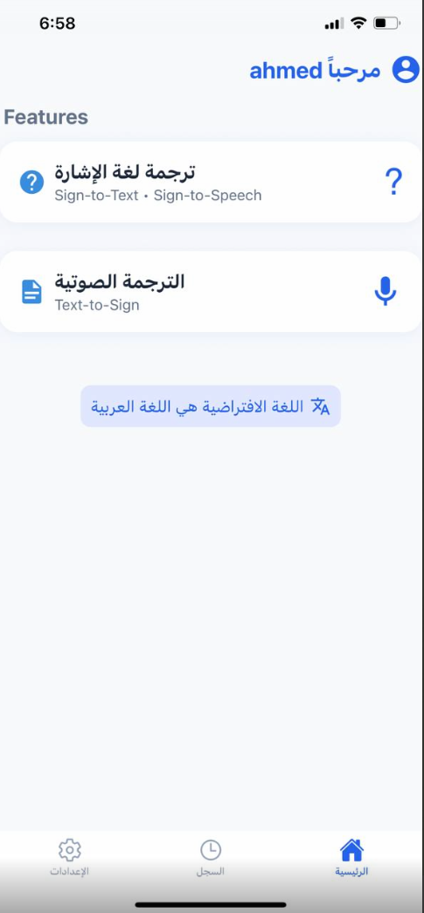
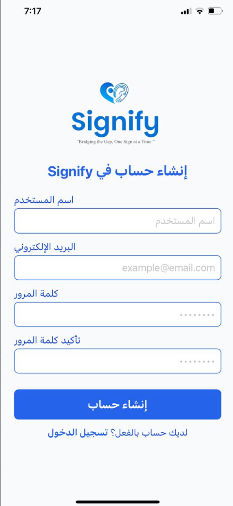
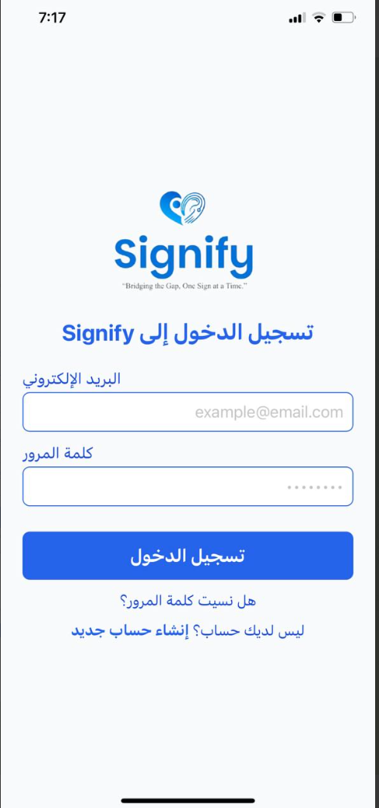
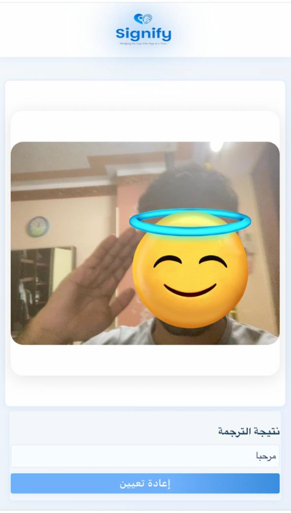
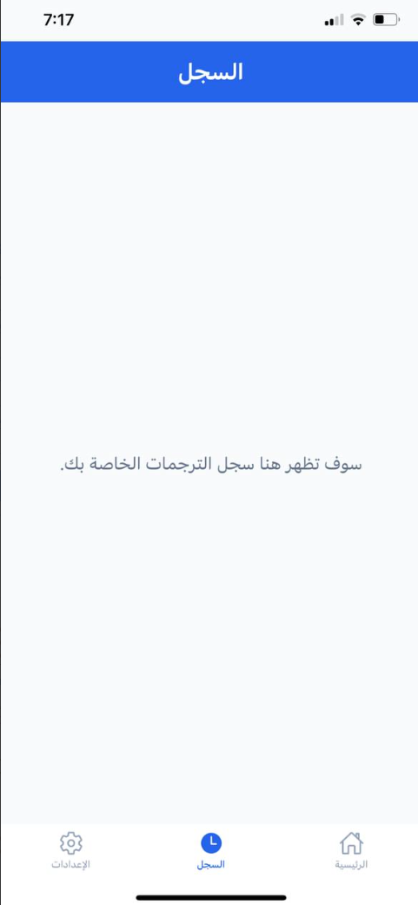
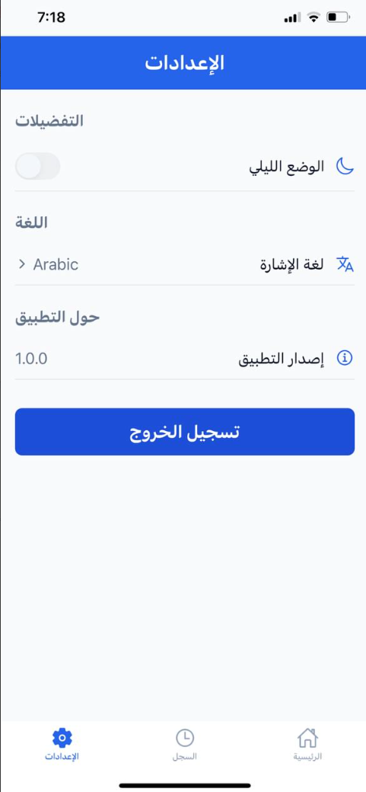

# Signify (ساينيفاي)


**Signify** is an integrated smart application that bridges the gap between sign language and spoken/written language. It provides easy-to-use, AI-powered solutions for translation between sign and text/speech, with a modern, user-friendly interface.

---

## 🚀 Features Overview

### 1. **Beautiful Home Screen**
- Modern, RTL-friendly design for Arabic.
- User greeting and clear navigation to all features.
- Quick access buttons for each main feature.



### 2. **User Authentication: Sign In & Sign Up**
- Secure registration and login for all users.
- Simple, attractive forms with clear error messages and validation.
- RTL support and blue-themed design for consistency.
- User data is securely handled and required for accessing main features.




---

### 3. **Sign-to-Text & Sign-to-Speech**
- Use your camera to recognize hand signs and convert them to Arabic text.
- Optionally, the app can speak the translated text using Text-to-Speech.
- Interactive UI with live camera, translation result, and reset button.



---

### 4. **Text/Voice-to-Sign Animation**
- Enter a word/phrase or use the microphone to speak.
- The app uses Google Cloud Speech-to-Text for accurate voice recognition (Arabic supported).
- Displays a skeleton animation (GIF/MP4) showing the sign for the recognized word/phrase.

---

### 5. **Skeleton Signs Recording & Visualization**
- Record new signs using your webcam.
- Extract skeleton landmarks using MediaPipe Holistic.
- Export sign animations as GIF/MP4 for use in the app.


---

### 6. **Smart Voice UI**
- Interactive microphone button with color and pulse animation when recording.
- "Listening..." text appears while recording.
- Seamless integration between UI and voice features.


---

### 7. **History Screen**
- View a list of your recent translations and sign activities.
- Easily revisit previous translations for reference or practice.
- Clean, organized layout with clear timestamps and details.



---

### 8. **Settings Screen**
- Customize your app experience (language, theme, etc.).
- Access help, about, and other preferences.
- Simple, intuitive design for easy navigation.



---

### 9. **Complete User Experience**
- Full Arabic (RTL) support.
- Consistent blue/white color palette and responsive design.
- Clear error messages and user guidance.
- Works on both mobile and web.

---

## 🛠️ Tech Stack
- **React Native & Expo**: Mobile app
- **ReactJS**: Web app
- **Flask (Python)**: Backend and AI processing
- **MediaPipe Holistic**: Skeleton landmark extraction
- **Google Cloud Speech-to-Text**: Accurate voice recognition
- **Text-to-Speech (Web Speech API & ResponsiveVoice)**: For speaking translations
- **FFmpeg**: Audio format conversion
- **Ngrok**: Local server tunneling

---

## 📂 Project Structure

```
backend/
  app.py
  ...
frontend/
  src/
    App.js
    HandDetection.js
    ...
translation-app/
  frontend/
    screens/
      HomeScreen.js
      SignAnimationScreen.js
    assets/
      skeleton_animation/
      ...
skeleton-signs/
  record_and_extract.py
  visualize_skeleton.py
  ...
assets/
  home_screen.png
  sign_to_text.png
  text_to_sign.png
  skeleton_signs.png
  voice_ui.png
  logo.png
  signup.png
  sign-in-screen.png
  sign-up-screen.png
  history-screen.png
  settings-screen.png
```

---

## ⚡ How to Run the Project

### 1. **Backend (Flask)**
```bash
cd backend
python3 -m venv venv
source venv/bin/activate
pip install -r requirements.txt
python app.py
```

### 2. **Web Frontend**
```bash
cd frontend
npm install
npm start
```

### 3. **Mobile App (Expo)**
```bash
cd translation-app/frontend
npm install
npm start
```

### 4. **Ngrok (for mobile access)**
```bash
ngrok http 3000   # For frontend
ngrok http 5000   # For backend
```
- Update URLs in the code to match new ngrok addresses.

---

**Signify – Bridging the gap, one sign at a time!**
